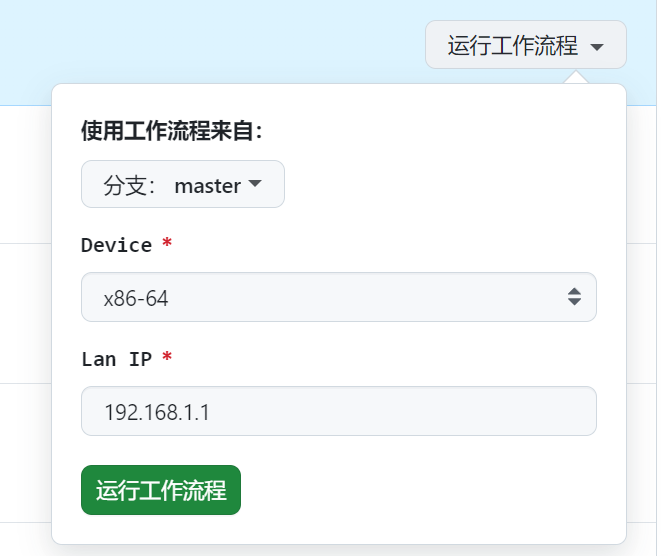

# Openwrt 自用固件


**说明**

> 本固件的源码来自于[Lean](https://github.com/coolsnowwolf/lede.git)
>
> Github Actions参考了[draco-china](https://github.com/draco-china/istoreos-actions) 和 [P3TERX](https://github.com/P3TERX/Actions-OpenWrt)这两位大佬的workflows


#### 固件总览


---


> 想来想去，软路由还是干好软路由该干的事情就够了，所以就只安装了以上的一些插件。


#### 使用教程

##### 手动执行



你可以在[Run workflow](https://github.com/wanansany/openwrt-actions/actions/workflows/openwrt.yaml)这选择固件对应的设备，以及固件默认的IP，然后等待它编译完成就好。

##### 定时执行

修改schedule.default文件，设置定时编译的设备固件以及IP，默认每周编译一次


#### 如何定制化

- **添加设备**

  如果设备列表中没有你的设备，你可以Fock本仓库，在devices目录中创建一个的目录，目录名为设备名，并在.github/workflows/openwrt.yaml中的options加上对应的一个选项。或者你可使用自己make好的.config文件替换掉x86-64下面的.config，Run workflow中device选择x86-64就好了。

```yaml
on:
  workflow_dispatch:
    inputs:
      device:
        description: "Device"
        type: choice
        options:
          # 注意,这里需要和devices目录下的设备目录名称一致
          - "x86-64"
          - "h28k"
        required: true
        default: "x86-64"
      lan:
        description: "Lan IP"
        type: string
        required: true
        default: "192.168.1.1"
```


- **添加插件**

  你可在feeds.conf.default中或者在setting.sh中添加自己想要的插件

  例：setting.sh

  ```shell
  #!/bin/bash
  
  rm -rf feeds/packages/lang/golang
  git clone https://github.com/kenzok8/golang feeds/packages/lang/golang
  
  
  git clone -b lua https://github.com/sbwml/luci-app-alist package/downloads/alist
  
  git clone https://github.com/esirplayground/luci-app-poweroff package/downloads/luci-app-poweroff
  
  git clone https://github.com/wangqn/luci-app-filebrowser package/downloads/luci-app-filebrowser
  
  
  rm -rf package/feeds/luci/luci-app-unblockmusic
  rm -rf package/feeds/luci/luci-app-adbyby-plus
  rm -rf package/feeds/luci/luci-app-argon-config
  rm -rf package/feeds/luci/luci-theme-argon
  rm -rf package/feeds/luci/luci-theme-argon-mod
  
  git clone -b master https://github.com/UnblockNeteaseMusic/luci-app-unblockneteasemusic.git package/downloads/luci-app-unblockneteasemusic
  
  git clone https://github.com/ywt114/luci-app-adbyby-plus-lite package/downloads/luci-app-adbyby-plus
  
  git clone -b 18.06 https://github.com/jerrykuku/luci-theme-argon.git package/downloads/luci-theme-argon
  git clone -b 18.06 https://github.com/jerrykuku/luci-app-argon-config.git package/downloads/luci-app-argon-config
  ```


- **生成.config**（参考：[Lean](https://github.com/coolsnowwolf/lede.git)）

  首先装好 Linux 系统，推荐 Debian 或 Ubuntu LTS

  1.安装依赖

  ```shell
  sudo apt update -y
  sudo apt full-upgrade -y
  sudo apt install -y ack antlr3 asciidoc autoconf automake autopoint binutils bison build-essential \
  bzip2 ccache clang cmake cpio curl device-tree-compiler flex gawk gettext gcc-multilib g++-multilib \
  git gperf haveged help2man intltool libc6-dev-i386 libelf-dev libfuse-dev libglib2.0-dev libgmp3-dev \
  libltdl-dev libmpc-dev libmpfr-dev libncurses-dev libncurses-dev libpython3-dev libreadline-dev \
  libssl-dev libtool llvm lrzsz genisoimage msmtp ninja-build p7zip p7zip-full patch pkgconf python3 \
  python3-pyelftools python3-setuptools qemu-utils rsync scons squashfs-tools subversion swig texinfo \
  uglifyjs upx-ucl unzip vim wget xmlto xxd zlib1g-dev
  ```

  2.下载源代码，更新 feeds 并选择配置

  feeds.default.conf和本仓库保持一致

  ```shell
  git clone https://github.com/coolsnowwolf/lede
  cd lede
  ./scripts/feeds update -a
  ./scripts/feeds install -a
  make menuconfig
  ```

  3.完成配置后会在目录下生成一个.config文件，把它拷贝出来就可以用了
  
  **注意：TARGET_ROOTFS建议不超过10G**


